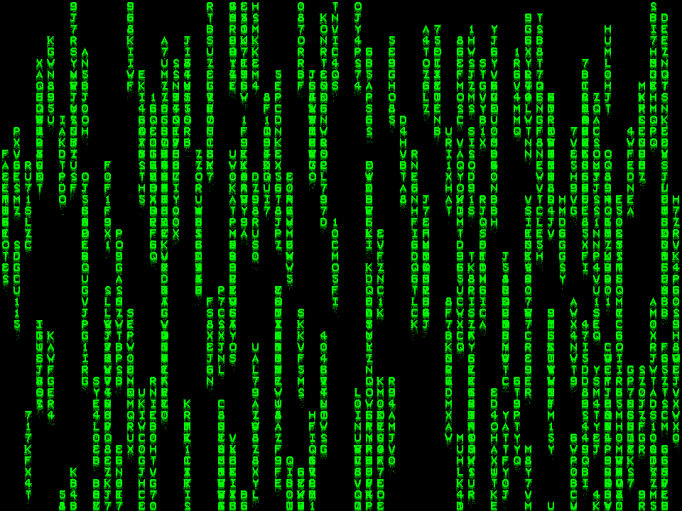

Proper usage documentation tbd; for now, here's some sample usage:

```js
import { draw as drawMatrix } from '/src/main.js'

const canvas = document.createElement('canvas');
canvas.width = 960;
canvas.height = 720;
const ctx = canvas.getContext('2d');

drawMatrix(ctx, {
	w: canvas.width,
	h: canvas.height,
	n_strs: 256,
	str_len: 8,
	n_passes: 16
})

const dataURL = canvas.toDataURL("image/png");
const img_el = document.querySelector('img');
img_el.src = dataURL;
```

You can directly use a canvas in the document; creating a png was relevant to my use case. For full documentation on the allowed options, check the jsdoc comment in src/main.js. Most notably, you can replace the method that creates the streaking effect with an arbitrary method that takes the current image state as input and outputs the next color. Currently the way I handle overlapping text is that I just *don't*, but it results in what looks like strange, unrecognizable characters, and I think the output is actually better that way.

Sample output with the above config:  


TODO: 
- Animate the output
- Allow the user to ensure certain strings are present
- Allow custom atlases for symbols